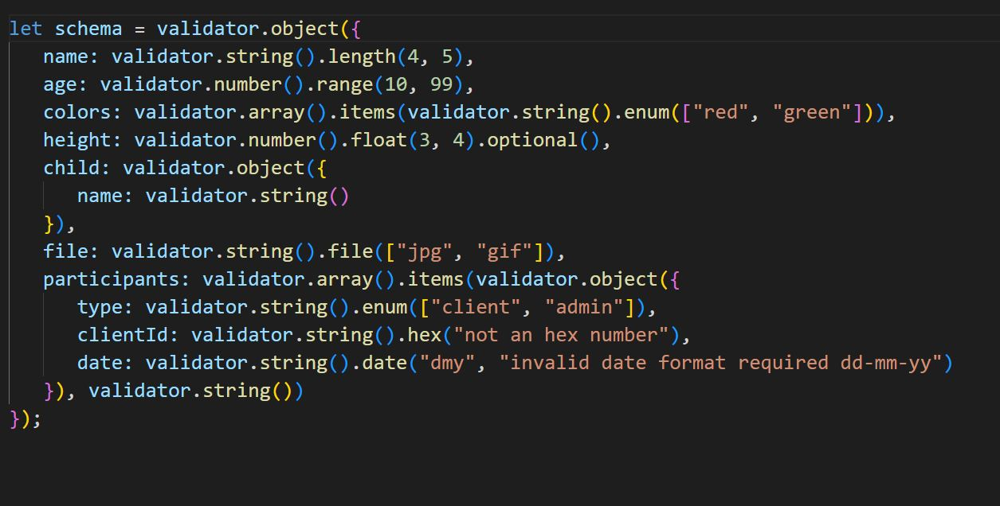
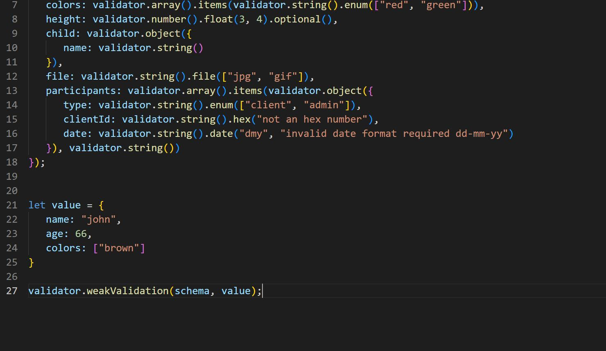

# js_projects
public repository for my projects

# Main

### advanced validator is used to validate objects in javascript!
### the module can run saftly on node and in the browser, no need to have different versions!
### use cases: forum validation,server side validation, client side validation

# Documentation 

### the libary works like joi,you have 5 types of validators object,array,string,number and boolean.in the browser version you need to use a script tag to add the libary
### the libary has a global vartiable called "validator" make sure there are no other refrences with that name. the validator object contains all  the functionalities 
### for the validation.

## *example:*

### as you can see from the example above each object has function which return the instance that was created from the first call and add a layer of validation to that ### object,each one of those function has optional last argument called msg,if that argument is specifed as in the example above at [participant.clientId],any error ### validation error accured during validation will return that message error,in complex validation that has more then one stage like string.date its better to leave this ### argument empty.

### all keys by default are required but you can change then to optinal like in the example at key [height].

# Validation Types:

### there are 2 validation types weakValidation and strongValidation! 
### from the example above to issue any of those validations you use thew validator object the first argument is the schema and the second is the inspected object

## *Diffrencies:*
### weakValidation validate only the adjucent keys that exist in both the schema and the target object, and evrey nested object bellow will be weak validated too,
### in the example the "value" object has 3 keys that exist in schema (age,colors,file) only those kets will be validate the rest of the schema would be ignore
### if the the inspected object has keys that dont exist in the schema they will be ignore too
### strongValidation check first that every key in inspected object exists in the schema,and make sure there no keys in the inspected object that dont exist in the schema this true for every nested object too.

# AbstractValidator

### parent class of every validator class

## *functions:*

## enum

### params :values=>array containing the allowed values for validation ,equality=>optinal function that compare 2 targets the inspected value and value from the values array ,if not specified === operator is used instead

## enumKey

### params keyPath=>key path stareting from the very root object (the object which started the validation),it validate if any of values in the array returned from the last key match the inspected current value, equality=>just like the enum function.
### note its better to leave the msg params empty because the path diving might fail

## custom

### create a custom validators.params=>func function except arguments => currentValue,rootAncestor,validationObject (object that store the function and all the info required for validation)

## optinal

### specify that this key is optinal

## required

### if you want to change default mesage returned from required validation

# ArrayValidator

## *functions:*

## length. params=>min,max specifie the allowed range size of the array

## items=>acccept any ampount of AbstractValidators used  to validate individual elements

## *validation:*

test each individual element and if there is any error it return an error array with keys corresponding to the there location in the inspected array for example if keys 0 and 4 where invalid so it return and array with errors at keys 0 and 4

# StringValidator

## *functions:*

### length - just like the array

### hex-check if string is hex number

### integer -check if string is an integer of any size no conversion to number takes place

### float-parmams =>numberOfDigitsToLeft ,numberOfDigitsToRight test if the string  is a float of any size no conversion to number takes place and count the number of allowed digits to left of decimal point and to its right

### file.params=>allowedFiles - array that specifie the suffix of the allowed files to be validate

### date .params =>dateFormat - 3 characters string containg oner of each of the characters 'y','m','d' y specify the year location at the string m the month d the day for example the format "ymd" will render this date "2021/2/11" true but this date  false "4/8/1999"

### email-validate email

### alphanum=validate if string has only the characters A-Za-z0-9

### regex-validate regex

### password=>params=>?min ,max,requireUnique validate if pasword cpontains at least one digit one lower case, one upper case and if requireUnique specifed unique characyter as well ,faster then regex

# NumberValidator

## *functions:*

### range=>min max tet if number is in range

### integer -> check if number is integer

### float -same as float in StringValidator class

### count =params size -number of digits allowed in integer

### even  -test if is even 

### positive -test if positive number

### negetive test if number is negative

